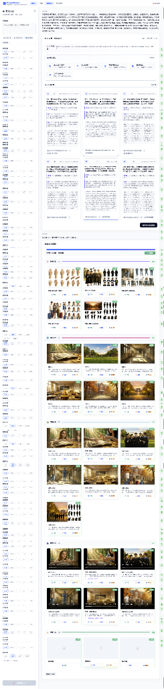

# FrameWeaver

> **智能视频创作工作流** — 从文本到视频的 AI 自动编排平台

一个基于 AI 智能体自动编排的视频生成平台。用户只需用自然语言描述想要的视频，系统自动完成角色设计、分镜规划、图像生成、视频合成、配音字幕等全流程。



---

## 功能特性

### 核心能力

- **为 AI 短剧深度优化**：内置导演级系统提示词，强制 3-6 秒快节奏剪辑、空间隔离动作防串色、以及智能规避对口型（Lip-sync）缺陷。
- **本地图片 Base64 直传**：彻底摆脱对外部图床（如 catbox）的依赖，增强本地部署稳定性。
- **AI 智能体自动编排**：基于思考模型分析用户需求，自动生成完整的视频制作计划
- **多角色分镜生成**：支持多角色场景，AI 自动规划角色外貌、站位、动作，防止角色特征融合
- **链式帧复用**：第一个分镜生成首帧+尾帧，后续分镜复用上一分镜尾帧作为首帧，实现无缝转场
- **参考图一致性**：支持上传角色/场景参考图，AI 通过 img2img 确保跨分镜视觉一致性
- **分镜级台词配音**：每个分镜可独立配置台词/旁白，使用 Edge-TTS 生成中文配音
- **字幕自动生成**：基于 Whisper 模型自动识别配音内容，生成 SRT 字幕并烧录到视频

### 多模型生态适配 (AI Models Support)

- **图像生成模型**：完全适配 Agnes Image 2.0/2.1、GPT Image 2、FLUX 等主流文生图/图生图模型，用于角色设定与分镜首尾帧。
- **视频生成模型**：全面支持 Agnes Video V2.0、Seedance 2.0、Runway 等高质量图生视频模型（完美支持首帧+尾帧关键帧插值模式）。
- **规划与编剧模型**：支持 DeepSeek-R1、GPT-5、Claude 4.6、Gemini 3.1 Pro 等强推理大语言模型进行剧本与工作流编排。
- **动态参数适配**：针对不同视频模型的有效时长档位（如 5s/10s/15s, 24fps）自动进行对齐与参数封装。

### 项目管理

- **项目分组**：多个视频归属到同一项目，统一管理

- **工作流可视化**：基于 React Flow 的 DAG 工作流编辑器，直观查看生成进度

- **执行看板**：卡片式 UI 展示每个任务的实时状态和生成结果

- **任务重试/续跑**：支持失败任务重试，已完成任务自动跳过

- **成品下载**：支持从浏览器直接下载最终合成视频

  

---

## 技术栈

| 层级 | 技术 |
|------|------|
| **后端框架** | FastAPI 构建异步 REST + WebSocket 服务 |
| **任务队列** | Celery + Redis 实现异步视频生成任务调度 |
| **数据库** | SQLAlchemy ORM + SQLite（可迁移至 PostgreSQL） |
| **前端框架** | React 19 + TypeScript + Vite |
| **工作流可视化** | @xyflow/react (React Flow) |
| **路由管理** | React Router v7 |
| **AI 规划** | DeepSeek-R1、GPT-5、Claude 4.6、Gemini 3.1 Pro 等强推理模型（剧本分析/分镜规划/提示词生成） |
| **图像生成** | Agnes Image, GPT Image 2, FLUX 等主流模型（文生图 + 图生图） |
| **视频生成** | Agnes Video, Seedance 2.0, Runway 等模型（支持关键帧模式） |
| **语音合成** | Edge-TTS（多角色中文配音） |
| **字幕生成** | OpenAI Whisper（语音转文字） |
| **视频处理** | FFmpeg + moviepy（拼接/配音/烧字幕） |

---

## 快速开始

### 环境要求

- Python 3.11+
- Node.js 18+
- Redis 7+
- FFmpeg

### 1. 克隆项目

```bash
git clone https://github.com/hello-ang/FrameWeaver.git
cd FrameWeaver
```

### 2. 后端配置

```bash
cd backend

# 创建虚拟环境
python -m venv venv
venv\Scripts\activate        # Windows
# source venv/bin/activate   # Linux/Mac

# 安装依赖
pip install -r requirements.txt
```

### 3. 配置环境变量

在 `backend/` 目录下创建 `.env` 文件：

```env
# ============================================================
# AI 模型配置（按能力分离，支持任意 OpenAI 兼容 API）
# ============================================================

# 规划模型（剧本规划/分镜设计/提示词生成）
# 示例: DeepSeek、GPT-4、Claude 等
PLANNING_API_KEY=your_deepseek_api_key
PLANNING_BASE_URL=https://api.deepseek.com
PLANNING_MODEL=deepseek-chat

# 图像生成模型（文生图/图生图）
# 示例: Agnes Image、GPT-Image、FLUX 等
# 注册地址：https://platform.agnes-ai.com/
IMAGE_API_KEY=your_agnes_api_key
IMAGE_BASE_URL=https://apihub.agnes-ai.com
IMAGE_MODEL=agnes-image-2.1-flash
IMG2IMG_MODEL=agnes-image-2.0-flash

# 视频生成模型（图生视频/文生视频）
# 示例: Agnes Video、Seedance 2.0、Runway 等
VIDEO_API_KEY=your_agnes_api_key
VIDEO_BASE_URL=https://apihub.agnes-ai.com
VIDEO_MODEL=agnes-video-v2.0

# ============================================================
# 其他配置
# ============================================================

# Redis 配置
REDIS_HOST=localhost
REDIS_PORT=6379

# 公网访问地址（可选，用于自托管图片供 AI 访问）
# 如果使用内网穿透工具，填写公网地址
PUBLIC_BASE_URL=
```

### 4. 启动 Redis

```bash
# 方式一：Docker（推荐）
docker run -d -p 6379:6379 redis:7-alpine

# 方式二：本地安装
redis-server
```

### 5. 启动后端服务

```bash
cd backend

# 终端 1：启动 FastAPI 服务
uvicorn app.main:app --reload --host 0.0.0.0 --port 8000

# 终端 2：启动 Celery Worker（异步任务处理）
celery -A app.workers.celery_app worker --loglevel=info --concurrency=4 --pool=solo
```

> **注意**：Windows 下 Celery 需要加 `--pool=solo` 参数

### 6. 启动前端

```bash
cd frontend

# 安装依赖
npm install

# 启动开发服务器
npm run dev
```

访问 http://localhost:5173 即可使用。

---

## 使用指南

### 智能体对话模式

1. 进入「智能体」页面，在输入框中用自然语言描述你想要的视频：

```
帮我做一个30秒的武侠短片：
- 一个黑衣剑客在月夜竹林中与白衣剑客对决
- 要有拔剑、对峙、交手、收剑的完整过程
- 电影级画面，4K画质
```

2. AI 智能体自动分析并生成：
   - 角色设定图（每个角色的详细外貌描述）
   - 分镜计划（每个镜头的画面、时长、运镜）
   - 完整的工作流 DAG

3. 确认计划后点击「开始生成」，系统自动执行全部任务

### 参考图功能

- 在对话中使用 `@` 提及已上传的角色/场景参考图
- AI 会使用 img2img 确保生成结果与参考图保持一致
- 支持角色设定图、场景环境图、关键帧参考图

### 执行看板

- **卡片式 UI**：每个任务以卡片形式展示，包含预览图、状态、进度
- **分组展示**：按阶段分组（角色设定 → 分镜画面 → 视频生成 → 后期合成）
- **实时状态**：WebSocket 推送实时更新任务进度
- **下载成品**：全部完成后可直接下载最终视频

### 项目管理

- 在「项目」页面创建/管理项目
- 每个项目可包含多个视频工作流
- 支持查看历史生成记录

---

## 项目结构

```
视频工作流/
├── backend/                    # 后端服务
│   ├── app/
│   │   ├── agent/             # AI 智能体核心
│   │   │   ├── agent_core.py      # 智能体规划（DeepSeek）
│   │   │   ├── workflow_planner.py # 工作流 DAG 生成
│   │   │   ├── executor.py        # 任务执行编排
│   │   │   └── reference_store.py # 参考图管理
│   │   ├── ai/                # AI 服务集成
│   │   │   ├── agnes_client.py    # Agnes AI API 客户端
│   │   │   ├── deepseek_client.py # DeepSeek API 客户端
│   │   │   ├── image_to_video.py  # 图生视频
│   │   │   ├── voice_synthesis.py # 语音合成（Edge-TTS）
│   │   │   └── subtitle_generator.py # 字幕生成（Whisper）
│   │   ├── api/               # REST API 路由
│   │   │   ├── agent.py           # 智能体对话接口
│   │   │   ├── projects.py        # 项目管理
│   │   │   ├── workflows.py       # 工作流管理
│   │   │   ├── tasks.py           # 任务管理
│   │   │   └── media.py           # 媒体文件上传
│   │   ├── models/            # 数据库模型
│   │   ├── services/          # 业务服务
│   │   ├── workers/           # Celery 异步任务
│   │   │   ├── celery_app.py      # Celery 配置
│   │   │   └── tasks.py           # 异步任务定义
│   │   ├── config.py          # 配置管理
│   │   └── main.py            # FastAPI 入口
│   └── requirements.txt
├── frontend/                   # 前端应用
│   └── src/
│       ├── components/        # React 组件
│       │   ├── ExecutionProgress.tsx  # 执行看板
│       │   ├── TaskCard.tsx           # 任务卡片
│       │   └── StoryboardPreview.tsx  # 分镜预览
│       ├── pages/             # 页面
│       │   ├── AgentChat.tsx          # 智能体对话
│       │   ├── WorkflowEditor.tsx     # 工作流编辑器
│       │   └── ProjectList.tsx        # 项目列表
│       └── api/
│           └── client.ts      # API 客户端
├── docker-compose.yml          # Docker 部署配置
└── README.md
```

---

## API 文档

启动后端后访问：
- Swagger UI: http://localhost:8000/docs
- ReDoc: http://localhost:8000/redoc

### 核心接口

| 方法 | 路径 | 说明 |
|------|------|------|
| POST | `/api/agent/chat` | 智能体对话（生成视频计划） |
| POST | `/api/agent/execute` | 执行工作流 |
| POST | `/api/agent/continue` | 续跑工作流（跳过已完成） |
| GET | `/api/tasks/{id}/download` | 下载任务输出文件 |
| GET | `/api/health/services` | 检查外部服务连通性 |

---

## Docker 部署

```bash
# 一键启动所有服务
docker-compose up -d

# 查看日志
docker-compose logs -f backend celery-worker
```

---

## 常见问题

### Q: AI 生成的分镜数量不对？

A: 系统提示词已明确要求 AI 根据 `total_duration` 计算镜头数量。如果仍然不准确，可以在对话中明确指定镜头数量，例如"请分成12个镜头"。

### Q: 视频时长不精确？

A: Agnes Video V2.0 API 的 `num_frames` 必须满足 `8n+1` 规则，系统会自动对齐到最近的有效档位（5s/10s/15s）。

### Q: 角色在不同分镜中长相不一致？

A: 上传角色参考图并使用 `@` 提及，AI 会通过 img2img 确保视觉一致性。

### Q: Celery Worker 代码更新后没生效？

A: 修改后端代码后需要手动重启 Celery Worker（Ctrl+C 然后重新启动）。

### Q: AI 生成的图片/视频无法访问？

A: 检查 `PUBLIC_BASE_URL` 配置。如果使用内网穿透，确保填写正确的公网地址。

---

## 许可证

本项目采用 **CC BY-NC 4.0（署名-非商业性使用 4.0 国际许可协议）** 开源。

### 使用条款

| 权限 | 说明 |
|------|------|
| ✅ 个人学习 | 允许个人学习、研究、非商业用途 |
| ✅ 修改分发 | 允许修改和再分发，但必须保留本许可证 |
| ✅ 署名要求 | **必须保留原作者署名**，注明出处 |
| ❌ 商业使用 | **严禁**用于任何商业用途 |
| ❌ 去除署名 | 不得删除或修改原作者署名信息 |

### 署名格式

使用本项目时，必须保留以下署名信息：

```
原作者：RuBin
项目名称：FrameWeaver - 智能视频创作工作流
项目地址：https://github.com/hello-ang/FrameWeaver
许可证：CC BY-NC 4.0
```

> 完整协议文本请参阅：https://creativecommons.org/licenses/by-nc/4.0/deed.zh
